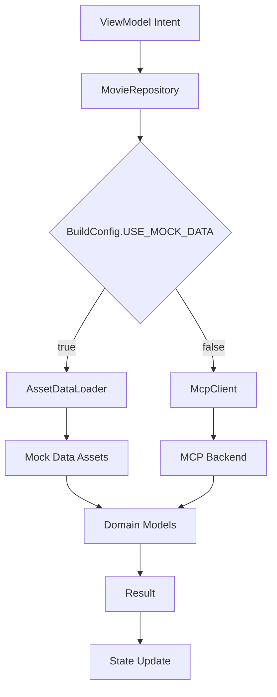

# Data Layer Implementation

**Tech Stack**: Kotlin 1.9.22, Koin 3.5.3, Ktor, Jetpack Compose  
**Architecture**: Clean Architecture + MVI Pattern  
**Build Variants**: `dummy` (mock), `prod` (MCP backend)

## Structure

```
data/
├── remote/
│   ├── api/           # API service interfaces
│   └── dto/           # Data Transfer Objects
├── mcp/               # MCP client for backend communication
├── mapper/            # Mappers between DTOs and domain models
├── model/             # Domain models
├── repository/        # Repository interfaces and implementations
├── util/              # Utility classes for data processing
└── di/                # Dependency injection modules
```

## Data Flow



## Quick Start

```kotlin
// Repository usage in ViewModel
class MoviesListViewModel(
    private val movieRepository: MovieRepository
) : ViewModel() {
    
    private fun loadMovies() {
        viewModelScope.launch {
            val result = movieRepository.getPopularMovies(page)
            when (result) {
                is Result.Success -> updateState(result.data)
                is Result.Error -> handleError(result.message)
            }
        }
    }
}
```

## Architecture Decisions

### MVI Model Component
- **Role**: Data layer serves as Model in MVI architecture
- **Flow**: Intent → Repository → Data Sources → Domain Models → Result → State
- **Type Safety**: Sealed `Result<T>` class for compile-time safety

### Clean Architecture
- **Repository Pattern**: Interface contracts with implementation separation
- **Dependency Inversion**: Repository depends on abstractions, not concretions
- **Single Responsibility**: Each component has focused purpose

### MCP Backend Integration
- **No External APIs**: All data through MCP backend (no TMDB API key)
- **UI Configuration**: Dynamic theming data included in responses
- **Mock Data Support**: Local asset data for development/testing

## Key Components

### Repository Layer
- **Interface**: `MovieRepository.kt` - Contract definition
- **Implementation**: `MovieRepositoryImpl.kt` - Dual mode (mock/prod)
- **API**: см. KDoc в коде

### MCP Client
- **Client**: `McpClient.kt` - High-level MCP operations
- **HTTP Transport**: `McpHttpClient.kt` - Ktor-based HTTP client
- **Models**: `McpRequest.kt`, `McpResponse.kt` - MCP protocol models
- **API**: см. KDoc в коде

### Domain Models
- **Core**: `Movie.kt` - Movie, MovieDetails, Genre, ProductionCompany
- **Response**: MovieListResponse, MovieDetailsResponse, Pagination
- **UI Config**: UiConfiguration, ColorScheme, TextConfiguration
- **Metadata**: Meta, GeminiColors, SentimentReviews
- **API**: см. KDoc в коде

### Mappers
- **MovieMapper**: `MovieMapper.kt` - DTO ↔ Domain model conversion
- **HTTP Mappers**: `HttpRequestMapper.kt`, `HttpResponseMapper.kt` - JSON handling
- **API**: см. KDoc в коде

### Utilities
- **AssetUtils**: `AssetUtils.kt` - Asset loading utilities
- **ColorUtils**: Color string → Compose Color conversion
- **API**: см. KDoc в коде

## MCP Protocol

### Request/Response Flow
1. **Request**: `McpRequest` → JSON serialization → HTTP POST
2. **Response**: HTTP response → JSON parsing → `McpResponse<T>`
3. **Mapping**: DTO → Domain model via `MovieMapper`

### Error Handling
- **Non-throwing**: All operations return `Result<T>` or `McpResponse<T>`
- **Fallback**: Mock data on network failures
- **Type Safety**: Sealed classes for compile-time safety

## Configuration

### Build Variants
- **dummy**: `BuildConfig.USE_MOCK_DATA = true`
- **prod**: `BuildConfig.USE_MOCK_DATA = false`

### Key Files
- **DI Module**: `di/DataModule.kt` - Koin configuration
- **Constants**: `model/StringConstants.kt` - Centralized constants
- **Default Data**: `model/DefaultData.kt` - Fallback data

### Asset Files
- **Mock Movies**: `assets/mock_movies.json`
- **Mock Details**: `assets/mock_movie_details.json`
- **UI Config**: `assets/ui_config.json`

## FAQ

**Q: How to switch between mock and production data?**  
A: Set `BuildConfig.USE_MOCK_DATA` in build variants.

**Q: Where are the API method signatures?**  
A: See KDoc in `remote/api/MovieApiService.kt` and `repository/MovieRepository.kt`.

**Q: How to add new movie fields?**  
A: Update DTOs in `remote/dto/`, domain models in `model/`, and mappers in `mapper/`.

**Q: Where is error handling implemented?**  
A: Repository layer uses `Result<T>` sealed class, MCP client uses `McpResponse<T>`.